# Analysing Geno-Pheno Data

## Introduction

`AMRgen` is a comprehensive R package designed to integrate
antimicrobial resistance genotype and phenotype data. It provides tools
to:

- Import AMR genotype data (e.g. from AMRFinderPlus, hAMRonization)

- Import AST phenotype data (e.g. public data from NCBI or EBI, or your
  own data in formats like Vitek or WHOnet)

- Conduct genotype-phenotype analyses to explore the impact of genotypic
  markers on phenotype, including via logistic regression, solo marker
  analysis, and upset plots

- Fetch MIC or disk zone reference distributions from EUCAST

This vignette walks through a basic workflow using example datasets
included in the `AMRgen` package, and explains how to wrangle your own
data files into the right formats to use the same workflow.

Start by loading the package:

``` r
library(AMRgen)
library(dplyr)
#> 
#> Attaching package: 'dplyr'
#> The following objects are masked from 'package:stats':
#> 
#>     filter, lag
#> The following objects are masked from 'package:base':
#> 
#>     intersect, setdiff, setequal, union
```

### 1. Genotype table

The
[`import_amrfp()`](https://AMRverse.github.io/AMRgen/reference/import_amrfp.md)
function lets you load genotype data from AMRFinderPlus output files,
and process it to generate an object with the key columns needed to work
with the `AMRgen` package.

``` r
# Example AMRFinderPlus genotyping output (from Allthebacteria project)
ecoli_geno_raw
#> # A tibble: 45,228 × 28
#>    Name      `Protein identifier` `Contig id`  Start   Stop Strand `Gene symbol`
#>    <chr>     <lgl>                <chr>        <dbl>  <dbl> <chr>  <chr>        
#>  1 SAMN0317… NA                   SAMN031776…  74721  75851 -      blaEC        
#>  2 SAMN0317… NA                   SAMN031776… 166214 169315 +      acrF         
#>  3 SAMN0317… NA                   SAMN031776…  20678  22033 -      glpT_E448K   
#>  4 SAMN0317… NA                   SAMN031776…    758   1969 -      floR         
#>  5 SAMN0317… NA                   SAMN031776…   4440   5666 +      mdtM         
#>  6 SAMN0317… NA                   SAMN031776…   3941   4798 +      blaTEM-1     
#>  7 SAMN0317… NA                   SAMN031776…    142    954 +      sul2         
#>  8 SAMN0317… NA                   SAMN031776…   1018   1818 +      aph(3'')-Ib  
#>  9 SAMN0317… NA                   SAMN031776…   1821   2654 +      aph(6)-Id    
#> 10 SAMN0317… NA                   SAMN031776…    788   1957 +      tet(A)       
#> # ℹ 45,218 more rows
#> # ℹ 21 more variables: `Sequence name` <chr>, Scope <chr>,
#> #   `Element type` <chr>, `Element subtype` <chr>, Class <chr>, Subclass <chr>,
#> #   Method <chr>, `Target length` <dbl>, `Reference sequence length` <dbl>,
#> #   `% Coverage of reference sequence` <dbl>,
#> #   `% Identity to reference sequence` <dbl>, `Alignment length` <dbl>,
#> #   `Accession of closest sequence` <chr>, `Name of closest sequence` <chr>, …

# Load AMRFinderPlus output
#    (replace 'ecoli_geno_raw' with the filepath for any AMRFinderPlus output)
ecoli_geno <- import_amrfp(ecoli_geno_raw, "Name")

# Check the format of the processed genotype table
head(ecoli_geno)
#> # A tibble: 6 × 36
#>   Name         gene  mutation  node  marker   marker.label drug_agent drug_class
#>   <chr>        <chr> <chr>     <chr> <chr>    <chr>        <ab>       <chr>     
#> 1 SAMN03177615 blaEC NA        blaEC blaEC    blaEC        NA         Beta-lact…
#> 2 SAMN03177615 acrF  NA        acrF  acrF     acrF         NA         Efflux    
#> 3 SAMN03177615 glpT  Glu448Lys glpT  glpT_E4… glpT:Glu448… FOS        Other ant…
#> 4 SAMN03177615 floR  NA        floR  floR     floR         CHL        Amphenico…
#> 5 SAMN03177615 floR  NA        floR  floR     floR         FLR        Other ant…
#> 6 SAMN03177615 mdtM  NA        mdtM  mdtM     mdtM         NA         Efflux    
#> # ℹ 28 more variables: `Protein identifier` <lgl>, `Contig id` <chr>,
#> #   Start <dbl>, Stop <dbl>, Strand <chr>, `Gene symbol` <chr>,
#> #   `Sequence name` <chr>, Scope <chr>, `Element type` <chr>,
#> #   `Element subtype` <chr>, Class <chr>, Subclass <chr>, Method <chr>,
#> #   `Target length` <dbl>, `Reference sequence length` <dbl>,
#> #   `% Coverage of reference sequence` <dbl>,
#> #   `% Identity to reference sequence` <dbl>, `Alignment length` <dbl>, …
```

The genotype table has one row for each genetic marker detected in an
input genome, i.e. one per strain/marker combination.

If your genotype data is not in AMRFinderPlus format, you can wrangle
other input data files into the necessary format.

The essential columns for a genotype table to work with `AMRgen`
functions are:

- `Name`: character string giving the sample name, used to link to
  sample names in the phenotype file (this column can have a different
  name, in which case you’ll need to make sure it is the first column in
  the dataframe OR pass its name to the functions using
  `geno_sample_col`)

- `marker`: character string giving the name of the genetic marker
  detected

- `drug_class`: character string giving the antibiotic class associated
  with this marker

NOTE: You should consider whether you have genomes with no AMR markers
detected by genotyping, and how to make sure these are include in your
analyses. E.g. AMRFinderPlus will output one row per genome/marker
combination, but if you have a genome with no markers detected, there
will be no row at all for that genome in the concatenated output file.
If your species has core genes included in AMRFinderPlus this probably
won’t be a problem as you would expect some calls for every genome
(e.g. AMRFinderPlus will report blaSHV, oqxA, oqxB, fosA in all
Klebsiella pneumoniae genomes, so all input genomes will appear in the
concatenated output file). An easy solution is to run a check to make
sure that all genome names in your input dataset are represented in the
genotype table, and if any are missing add empty rows for these using
e.g. `tibble(Name=missing_samples) %>% bind_rows(genotype_table)`.

### 2. Phenotype table

The
[`import_ncbi_ast()`](https://AMRverse.github.io/AMRgen/reference/import_ncbi_ast.md)
function imports AST data from NCBI format files.

``` r
# Example E. coli AST data from NCBI
# This one has already been imported and phenotypes interpreted from assay data
# You can make your own from different file formats, and interpret against breakpoints, using:
#    import_ast("filepath/NCBI_AST.tsv", format="ncbi", interpret_clsi=T)
#    import_ast("filepath/Vitek_AST.tsv", format="vitek", interpret_eucast=T)

ecoli_ast
#> # A tibble: 4,170 × 10
#>    id           drug_agent     mic  disk pheno_clsi ecoff guideline method
#>    <chr>        <ab>         <mic> <dsk> <sir>      <sir> <chr>     <chr> 
#>  1 SAMN36015110 CIP        <128.00    NA   R          R   CLSI      NA    
#>  2 SAMN11638310 CIP         256.00    NA   R          R   CLSI      NA    
#>  3 SAMN05729964 CIP          64.00    NA   R          R   CLSI      Etest 
#>  4 SAMN10620111 CIP         >=4.00    NA   R          R   CLSI      NA    
#>  5 SAMN10620168 CIP         >=4.00    NA   R          R   CLSI      NA    
#>  6 SAMN10620104 CIP         <=0.25    NA   S          R   CLSI      NA    
#>  7 SAMN10620102 CIP         >=4.00    NA   R          R   CLSI      NA    
#>  8 SAMN10620129 CIP         >=4.00    NA   R          R   CLSI      NA    
#>  9 SAMN10620121 CIP         >=4.00    NA   R          R   CLSI      NA    
#> 10 SAMN10620086 CIP         >=4.00    NA   R          R   CLSI      NA    
#> # ℹ 4,160 more rows
#> # ℹ 2 more variables: pheno_provided <sir>, spp_pheno <mo>

head(ecoli_ast)
#> # A tibble: 6 × 10
#>   id           drug_agent     mic  disk pheno_clsi ecoff guideline method
#>   <chr>        <ab>         <mic> <dsk> <sir>      <sir> <chr>     <chr> 
#> 1 SAMN36015110 CIP        <128.00    NA   R          R   CLSI      NA    
#> 2 SAMN11638310 CIP         256.00    NA   R          R   CLSI      NA    
#> 3 SAMN05729964 CIP          64.00    NA   R          R   CLSI      Etest 
#> 4 SAMN10620111 CIP         >=4.00    NA   R          R   CLSI      NA    
#> 5 SAMN10620168 CIP         >=4.00    NA   R          R   CLSI      NA    
#> 6 SAMN10620104 CIP         <=0.25    NA   S          R   CLSI      NA    
#> # ℹ 2 more variables: pheno_provided <sir>, spp_pheno <mo>
```

Data can be imported from various standard formats using the
`import_ast` function, and re-interpreted using latest breakpoints
and/or ECOFF. Use
[`?import_ast`](https://AMRverse.github.io/AMRgen/reference/import_ast.md)
to see the available formats and other options.

If your assay data is not in a standard format, you can wrangle other
input data files into the necessary format, manually and/or with the
help of the `format_ast` function.

``` r
?import_ast

?format_ast
```

The phenotype table is long form, with one row for each assay
measurement, i.e. one per strain/drug combination.

The essential columns for a phenotype table to work with `AMRgen`
functions are:

- `id`: character string giving the sample name, used to link to sample
  names in the genotype file (this column can have a different name, in
  which case you’ll need to make sure it is the first column in the
  dataframe OR pass its name to the functions using `pheno_sample_col`)

- `spp_pheno`: species in the form of an AMR package `mo` class (can be
  created from a column with species name as string, using
  `AMR::as.mo(species_string)`)

- `drug_agent`: antibiotic name in the form of an AMR package `ab` class
  (can be created from a column with antibiotic name as string, using
  `AMR::as.ab(antibiotic_string)`)

- a phenotype column, e.g. the import functions output fields
  `pheno_eucast`, `pheno_clsi`, `pheno_provided`, `ecoff`: S/I/R
  phenotype calls in the form of an AMR package `sir` class (can be
  created from a column with phenotype values as string, using
  `AMR::as(sir_string)`, or generated by interpreting MIC or disk assay
  data using
  [`AMR::as.sir`](https://amr-for-r.org/reference/as.sir.html))

If you want to do analyses with raw assay data (e.g. upset plots) you
will need that data in one or both of:

- `mic`: MIC in the form of an AMR package `mic` class (can be created
  from a column with assay values as string, using
  `AMR::as.mic(mic_string)`)

- `disk`: disk diffusion zone diameter in the form of an AMR package
  `disk` class (can be created from a column with assay values as
  string, using `AMR::as.disk(disk_string)`)

The import functions also standardise names for the following common
fields:

- `method`: The laboratory testing method (e.g., “MIC”, “disk
  diffusion”, “Etest”, “agar dilution”)

- `platform`: The laboratory testing platform/instrument if relevant
  (e.g., “Vitek”, “Phoenix”, “Sensititre”).

- `guideline`: The testing standard recorded in the input file as being
  used to make the provided phenotype interpretations (e.g. “CLSI”,
  “EUCAST”)

- `source`: An identifier for the dataset from which each data point was
  sourced (e.g. study or hospital name, pubmed ID, bioproject
  accession).

### 3. Plot phenotype data distribution

It is always a good idea to check the distribution of raw AST data that
we have to work with. The function
[`assay_by_var()`](https://AMRverse.github.io/AMRgen/reference/assay_by_var.md)
can be used to plot the distribution of MIC or disk measurements,
coloured by a variable.

``` r
# Example E. coli AST data from NCBI

# Plot MIC distribution, coloured by CLSI S/I/R call
assay_by_var(pheno_table = ecoli_ast, antibiotic = "Ciprofloxacin", measure = "mic", colour_by = "pheno_clsi")
```

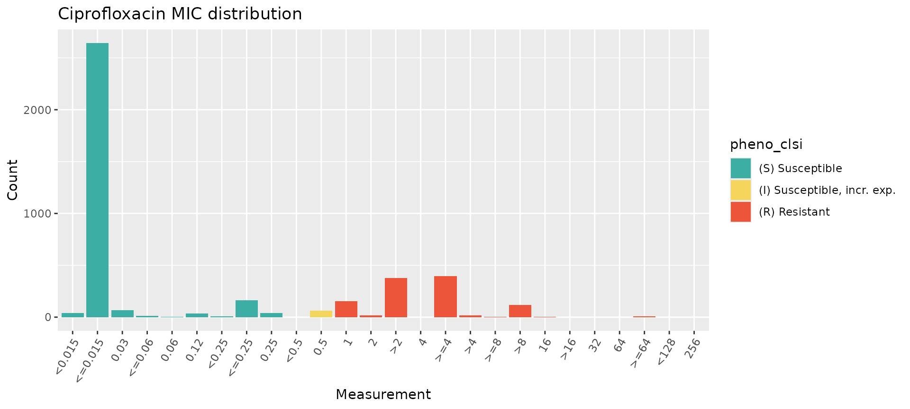

It’s a good idea to make sure that the `SIR` field in the input data
file has been interpreted correctly against the breakpoints. The AMRgen
function
[`checkBreakpoints()`](https://AMRverse.github.io/AMRgen/reference/checkBreakpoints.md)
can be used to help look up breakpoints in the `AMR` package. Or, if you
provide the function
[`assay_by_var()`](https://AMRverse.github.io/AMRgen/reference/assay_by_var.md)
with a species and guideline, it can look up the breakpoints and ECOFF
and annotate these directly on the plot.

``` r
# Look up breakpoints recorded in the AMR package
checkBreakpoints(species = "E. coli", guide = "CLSI 2025", antibiotic = "Ciprofloxacin", assay = "MIC")
#>   MIC breakpoints determined using AMR package: S <= 0.25 and R > 1
#> $breakpoint_S
#> [1] 0.25
#> 
#> $breakpoint_R
#> [1] 1
#> 
#> $bp_standard
#> [1] "-"

# Specify species and guideline, to annotate with CLSI breakpoints
assay_by_var(pheno_table = ecoli_ast, antibiotic = "Ciprofloxacin", measure = "mic", colour_by = "pheno_clsi", species = "E. coli", guideline = "CLSI 2025")
#>   MIC breakpoints determined using AMR package: S <= 0.25 and R > 1
```

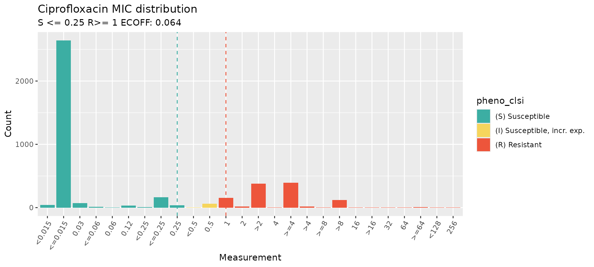

When aggregating AST data from different methods and sources, it is a
good idea to check the distributions broken down by method or source.
This can be done easily by passing the
[`assay_by_var()`](https://AMRverse.github.io/AMRgen/reference/assay_by_var.md)
function a variable name to facet by, which means a separate
distribution will be plotted for each value of that variable (e.g. each
type of ‘method’ in our AST test data). Note that this public data from
NCBI includes non-standard values in the platform (Sensititre /
Sensititer) in the platform

``` r
# specify facet_var="method" to generate facet plots by assay method
mic_by_platform <- assay_by_var(pheno_table = ecoli_ast, antibiotic = "Ciprofloxacin", measure = "mic", colour_by = "pheno_clsi", species = "E. coli", guideline = "CLSI 2025", facet_var = "method")
#>   MIC breakpoints determined using AMR package: S <= 0.25 and R > 1

mic_by_platform$plot
#> NULL
```

### 4. Download reference assay distributions and compare to your data

It can also be helpful to check how your MIC or disk zone distribution
compares to the reference distributions, to get a sense of whether your
assays were calibrated correctly or if there may be some issues with a
given dataset. AMRgen has functions to download the latest reference
distributions from EUCAST (mic.eucast.org), and plot them on their own
or with your data overlaid.

``` r
# get MIC distribution for ciprofloxacin, for all organisms
get_eucast_mic_distribution("cipro")
#> # A tibble: 2,033 × 4
#>    microorganism              microorganism_code   mic count
#>    <chr>                      <mo>               <mic> <int>
#>  1 Achromobacter xylosoxidans B_ACHRMB_XYLS      0.002     0
#>  2 Achromobacter xylosoxidans B_ACHRMB_XYLS      0.004     0
#>  3 Achromobacter xylosoxidans B_ACHRMB_XYLS      0.008     0
#>  4 Achromobacter xylosoxidans B_ACHRMB_XYLS      0.016     0
#>  5 Achromobacter xylosoxidans B_ACHRMB_XYLS      0.030     0
#>  6 Achromobacter xylosoxidans B_ACHRMB_XYLS      0.060     0
#>  7 Achromobacter xylosoxidans B_ACHRMB_XYLS      0.125     0
#>  8 Achromobacter xylosoxidans B_ACHRMB_XYLS      0.250     1
#>  9 Achromobacter xylosoxidans B_ACHRMB_XYLS      0.500     0
#> 10 Achromobacter xylosoxidans B_ACHRMB_XYLS      1.000     6
#> # ℹ 2,023 more rows

# specify microorganism to only get results for that pathogen
ecoli_cip_mic_data <- get_eucast_mic_distribution("cipro", "E. coli")

# get disk diffusion data instead
ecoli_cip_disk_data <- get_eucast_disk_distribution("cipro", "E. coli")

# plot the MIC data
mics <- rep(ecoli_cip_mic_data$mic, ecoli_cip_mic_data$count)
ggplot2::autoplot(
  mics,
  ab = "cipro",
  mo = "E. coli",
  title = "E. coli cipro reference distribution"
)
```

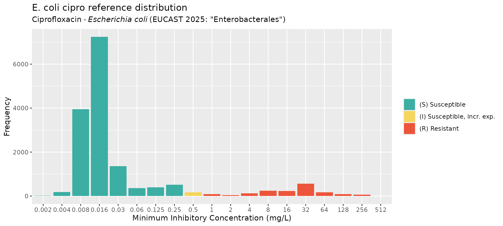

``` r
# Compare reference distribution to random test data
my_mic_values <- AMR::random_mic(500)
comparison <- compare_mic_with_eucast(my_mic_values, ab = "cipro", mo = "E. coli")
#> Joining with `by = join_by(value)`
comparison
#> # A tibble: 25 × 3
#>    value     user eucast
#>  * <fct>    <int>  <int>
#>  1 <=0.0005    47      0
#>  2 0.001       29      0
#>  3 0.002       44     14
#>  4 0.004       33    189
#>  5 0.008       28   3952
#>  6 0.016       34   7238
#>  7 0.03         0   1355
#>  8 0.032       24      0
#>  9 0.06         0    356
#> 10 0.064       32      0
#> # ℹ 15 more rows
#> Use ggplot2::autoplot() on this output to visualise.
ggplot2::autoplot(comparison)
```

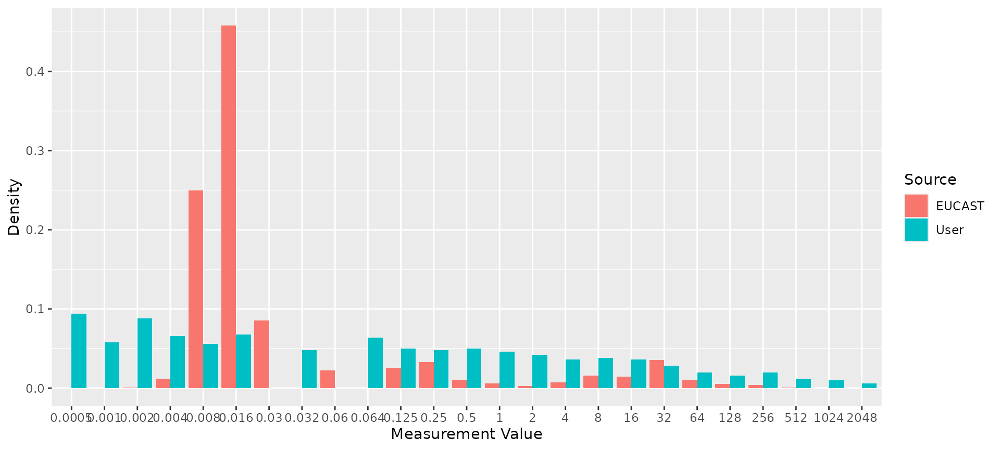

``` r


# Compare reference distribution to example E. coli data
ecoli_cip <- ecoli_ast$mic[ecoli_ast$drug_agent == "CIP"]
comparison <- compare_mic_with_eucast(ecoli_cip, ab = "cipro", mo = "E. coli")
#> Joining with `by = join_by(value)`
comparison
#> # A tibble: 34 × 3
#>    value    user eucast
#>  * <fct>   <int>  <int>
#>  1 0.002       0     14
#>  2 0.004       0    189
#>  3 0.008       0   3952
#>  4 <0.015     41      0
#>  5 <=0.015  2642      0
#>  6 0.016       0   7238
#>  7 0.03       69   1355
#>  8 <=0.06     11      0
#>  9 0.06        5    356
#> 10 0.12       34      0
#> # ℹ 24 more rows
#> Use ggplot2::autoplot() on this output to visualise.
ggplot2::autoplot(comparison)
```

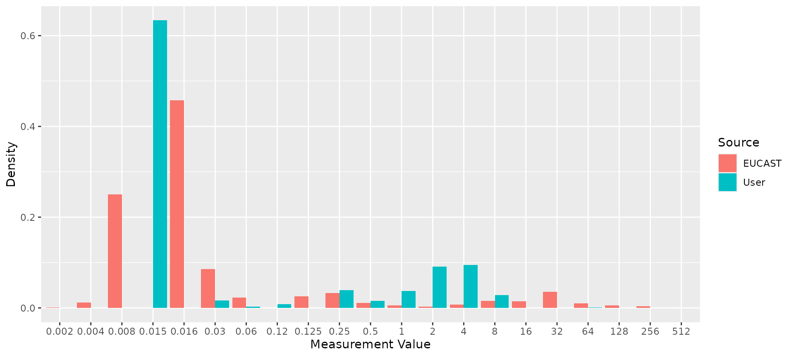

### 5. Combine genotype and phenotype data for a given drug

The genotype and phenotype tables can include data related to many
different drugs, but we need to analyse things one drug at a time. The
function
[`get_binary_matrix()`](https://AMRverse.github.io/AMRgen/reference/get_binary_matrix.md)
can be used to extract phenotype data for a specified drug, and genotype
data for markers associated with a specified drug class. It returns a
single dataframe with one row per strain, for the subset of strains that
appear in both the genotype and phenotype input tables. Each row
indicates, for one strain, both the phenotypes (with SIR column, any
assay columns if desired, and boolean 1/0 coding of R and NWT status)
and the genotypes (one column per marker, with boolean 1/0 coding of
marker presence/absence).

``` r
# Get matrix combining phenotype data for ciprofloxacin, binary calls for R/NWT phenotype,
#    and genotype presence/absence data for all markers associated with the relevant drug
#    class (which are labelled "Quinolones" in AMRFinderPlus).
cip_bin <- get_binary_matrix(
  ecoli_geno,
  ecoli_ast,
  antibiotic = "Ciprofloxacin",
  drug_class_list = "Quinolones",
  sir_col = "pheno_clsi",
  keep_assay_values = TRUE,
  keep_assay_values_from = "mic"
)
#>  Defining NWT in binary matrix using ecoff column provided: ecoff

# check format
head(cip_bin)
#> # A tibble: 6 × 50
#>   id     pheno ecoff     mic     R   NWT gyrA_S83L gyrA_D87Y gyrA_D87N parC_S80I
#>   <chr>  <sir> <sir>   <mic> <dbl> <dbl>     <dbl>     <dbl>     <dbl>     <dbl>
#> 1 SAMN0…   S     S   <=0.015     0     0         0         0         0         0
#> 2 SAMN0…   S     S   <=0.015     0     0         0         0         0         0
#> 3 SAMN0…   S     S   <=0.015     0     0         0         0         0         0
#> 4 SAMN0…   S     R     0.250     0     1         1         0         0         0
#> 5 SAMN0…   S     R     0.120     0     1         0         1         0         0
#> 6 SAMN0…   S     S   <=0.015     0     0         0         0         0         0
#> # ℹ 40 more variables: parE_S458A <dbl>, parC_S80R <dbl>, parE_L416F <dbl>,
#> #   qnrB6 <dbl>, gyrA_D87G <dbl>, parC_S57T <dbl>, parC_E84A <dbl>,
#> #   soxS_A12S <dbl>, qnrB2 <dbl>, qnrS2 <dbl>, parC_E84K <dbl>,
#> #   parC_A56T <dbl>, qnrB19 <dbl>, `aac(6')-Ib-cr5` <dbl>, parC_E84V <dbl>,
#> #   parE_I529L <dbl>, parE_S458T <dbl>, parE_E460D <dbl>, parC_E84G <dbl>,
#> #   qnrS1 <dbl>, marR_S3N <dbl>, `aac(6')-Ib-cr` <dbl>, soxR_R20H <dbl>,
#> #   qnrB1 <dbl>, parE_I355T <dbl>, soxR_G121D <dbl>, qnrB4 <dbl>, qepA <dbl>, …

# list colnames, to see full list of quinolone markers included
colnames(cip_bin)
#>  [1] "id"             "pheno"          "ecoff"          "mic"           
#>  [5] "R"              "NWT"            "gyrA_S83L"      "gyrA_D87Y"     
#>  [9] "gyrA_D87N"      "parC_S80I"      "parE_S458A"     "parC_S80R"     
#> [13] "parE_L416F"     "qnrB6"          "gyrA_D87G"      "parC_S57T"     
#> [17] "parC_E84A"      "soxS_A12S"      "qnrB2"          "qnrS2"         
#> [21] "parC_E84K"      "parC_A56T"      "qnrB19"         "aac(6')-Ib-cr5"
#> [25] "parC_E84V"      "parE_I529L"     "parE_S458T"     "parE_E460D"    
#> [29] "parC_E84G"      "qnrS1"          "marR_S3N"       "aac(6')-Ib-cr" 
#> [33] "soxR_R20H"      "qnrB1"          "parE_I355T"     "soxR_G121D"    
#> [37] "qnrB4"          "qepA"           "gyrA_S83A"      "qnrA1"         
#> [41] "parE_D475E"     "parC_A108V"     "qepA1"          "parE_E460K"    
#> [45] "gyrA_S83W"      "marR_R77C"      "parE_L445H"     "parE_I464F"    
#> [49] "qnrB"           "acrR_R45C"
```

This binary matrix can be used as the starting a lot of downstream
analyses.

For example, we can use it as input to `assay_by_var` to plot the assay
distribution coloured by presence of a particular genetic marker

``` r
assay_by_var(cip_bin, measure = "mic", colour_by = "parC_S80I", antibiotic = "Ciprofloxacin")
```

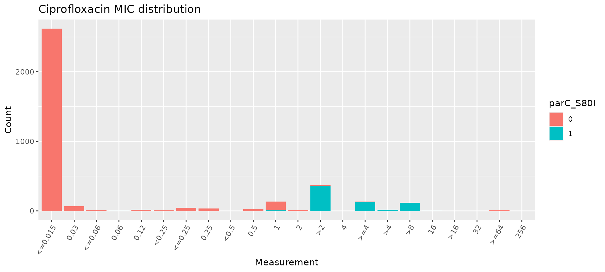

``` r

# count the number of gyrA mutations per genome
gyrA_mut <- cip_bin %>%
  dplyr::mutate(gyrA_mut = rowSums(across(contains("gyrA_") & where(is.numeric)), na.rm = T)) %>%
  select(mic, gyrA_mut)

# plot the MIC distribution, coloured by count of gyrA mutations
mic_by_gyrA_count <- assay_by_var(gyrA_mut, measure = "mic", colour_by = "gyrA_mut", colour_legend_label = "No. gyrA mutations", antibiotic = "Ciprofloxacin")

mic_by_gyrA_count
```

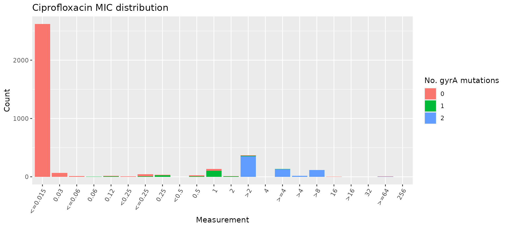

``` r

# count the number of genetic determinants per genome
marker_count <- cip_bin %>%
  mutate(marker_count = rowSums(across(where(is.numeric) & !any_of(c("R", "NWT"))), na.rm = T)) %>%
  select(mic, marker_count)

# plot the MIC distribution, coloured by count of associated genetic markers
mic_by_marker_count <- assay_by_var(marker_count, measure = "mic", colour_by = "marker_count", colour_legend_label = "No. markers detected", antibiotic = "Ciprofloxacin", bar_cols = viridisLite::viridis(max(marker_count$marker_count) + 1))

mic_by_marker_count
```

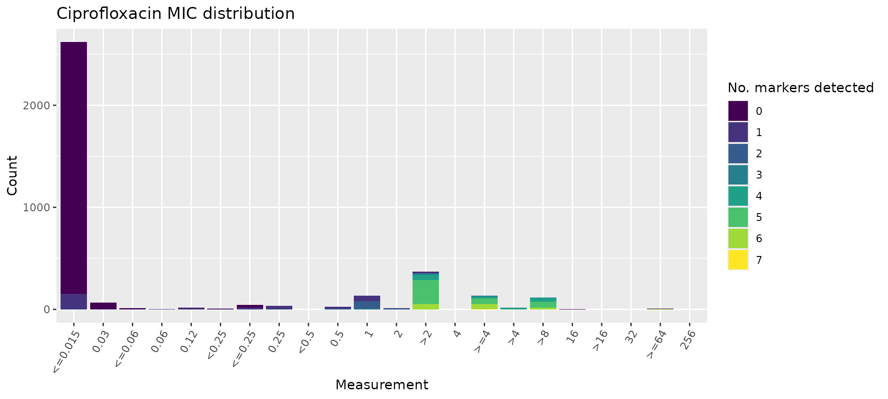

### 6. Model a binary drug phenotype using genetic marker presence/absence data

Logistic regression models can be informative to get an overview of the
association between a drug resistance phenotype, and each marker thought
to be associated with the relevant drug class.

The
[`amr_logistic()`](https://AMRverse.github.io/AMRgen/reference/amr_logistic.md)
function uses the `get_binary_matrix` function to generate binary-coded
genotype and phenotype data for a specified drug and class; and fits two
logistic regression models of the form
`R ~ marker1 + marker2 + marker3 + ...` and
`NWT ~ marker1 + marker2 + marker3 + ...`.

Note that the ‘NWT’ variable in the latter model can be taken either
from a precomputed ECOFF-based call of WT=wildtype/NWT=nonwildtype
(encoded in the input column `ecoff_col`), or computed from the S/I/R
phenotype as NWT=R/I and WT=S.

The
[`amr_logistic()`](https://AMRverse.github.io/AMRgen/reference/amr_logistic.md)
function can fit the model using either the standard logistic regression
approach implemented in the [`glm()`](https://rdrr.io/r/stats/glm.html)
function, or Firth’s bias-reduced penalized-likelihood logistic
regression implemented in the `logistf` package. The default is to use
Firth’s regression, as standard logistic regression can fail if there
are too observations in some subgroups, which happens quite often with
this kind of data. To use [`glm()`](https://rdrr.io/r/stats/glm.html)
instead, set `glm=TRUE`.

The function also filters out markers with too few observations in the
combined genotype/phenotype dataset. The default minimum is 10 but this
can be changed using the `maf` parameter (maf stands for ‘minor allele
frequency’). If you are having trouble fitting models, it may be because
too many markers and combinations have very few observations, and you
might try increasing the `maf` value to ensure that rare markers are
excluded prior to model fitting.

Using this modelling approach, a negative association with a single
marker and phenotype call of R and NWT is a strong indication that
marker does not contribute to resistance. Note however that a positive
association between a marker and R or NWT does not necessarily imply the
marker is independently contributing to the resistance phenotype, as
there may be non-independence between markers that is not adequately
adjusted for by the model.

The function returns 4 objects:

- `modelR, modelNWT`: data frames summarising each model, with beta
  coefficient, lower and upper values of 95% confidence intervals, and
  p-value for each marker (generated from the raw model output using
  [`logistf_details()`](https://AMRverse.github.io/AMRgen/reference/logistf_details.md)
  or
  [`glm_details()`](https://AMRverse.github.io/AMRgen/reference/glm_details.md)
  as relevant)

- `plot`: a ggplot2 object generated from the `modelR` and `modelNWT`
  objects using the
  [`compare_estimates()`](https://AMRverse.github.io/AMRgen/reference/compare_estimates.md)
  function

- `bin_mat`: the binary matrix used as input to the regression models

``` r
# Manually run Firth's logistic regression model using the binary matrix produced above
dataR <- cip_bin[, setdiff(names(cip_bin), c("id", "pheno", "ecoff", "mic", "NWT"))]
dataR <- dataR[, colSums(dataR, na.rm = TRUE) > 5]
modelR <- logistf::logistf(R ~ ., data = dataR, pl = FALSE)
#> Warning in logistf::logistf(R ~ ., data = dataR, pl = FALSE): logistf.fit:
#> Maximum number of iterations for full model exceeded. Try to increase the
#> number of iterations or alter step size by passing 'logistf.control(maxit=...,
#> maxstep=...)' to parameter control

summary(modelR)
#> logistf::logistf(formula = R ~ ., data = dataR, pl = FALSE)
#> 
#> Model fitted by Penalized ML
#> Coefficients:
#>                        coef  se(coef) lower 0.95 upper 0.95       Chisq
#> (Intercept)      -5.3126336 0.2631271 -5.8283532 -4.7969141         Inf
#> gyrA_S83L         5.0964769 0.3396242  4.4308257  5.7621280         Inf
#> gyrA_D87Y         0.6106668 1.9594688 -3.2298214  4.4511550  0.09712520
#> gyrA_D87N         1.0360455 1.2910108 -1.4942892  3.5663801  0.64401779
#> parC_S80I         3.5373730 1.2607416  1.0663649  6.0083812  7.87244336
#> parE_S458A       -0.6704877 1.4211494 -3.4558894  2.1149139  0.22258823
#> parC_S80R         0.9483222 0.9365007 -0.8871855  2.7838299  1.02540544
#> parE_L416F        1.0898410 1.4770169 -1.8050589  3.9847409  0.54444672
#> parC_S57T         1.4138484 1.4556144 -1.4391034  4.2668003  0.94343723
#> soxS_A12S         1.5835771 1.4858311 -1.3285984  4.4957527  1.13589853
#> parC_A56T         2.6649799 1.5169240 -0.3081365  5.6380963  3.08645711
#> qnrB19            5.2724510 0.4539251  4.3827740  6.1621279         Inf
#> `aac(6')-Ib-cr5`  4.2781111 1.3428296  1.6462134  6.9100089 10.14991218
#> parC_E84V        -0.5431447 1.7851855 -4.0420441  2.9557547  0.09256874
#> parE_I529L        2.0650647 0.4422569  1.1982571  2.9318724 21.80309146
#> parE_S458T       -2.7638947 1.9476308 -6.5811808  1.0533915  2.01386205
#> parE_E460D       -1.5247536 1.8858945 -5.2210388  2.1715317  0.65367903
#> parC_E84G         1.2138825 1.5879100 -1.8983640  4.3261290  0.58438832
#> qnrS1             5.5078662 0.4382199  4.6489710  6.3667613         Inf
#> marR_S3N          3.1497735 0.5128996  2.1445088  4.1550382 37.71325169
#> parE_I355T        1.9452320 0.8701522  0.2397651  3.6506990  4.99749513
#> soxR_G121D       -2.5711031 1.6085609 -5.7238245  0.5816183  2.55484162
#> qnrB4             6.9220299 1.5713224  3.8422946 10.0017653 19.40601369
#> parE_D475E       -0.7090156 1.4119171 -3.4763223  2.0582910  0.25216990
#>                             p method
#> (Intercept)      0.000000e+00      1
#> gyrA_S83L        0.000000e+00      1
#> gyrA_D87Y        7.553072e-01      1
#> gyrA_D87N        4.222596e-01      1
#> parC_S80I        5.019379e-03      1
#> parE_S458A       6.370749e-01      1
#> parC_S80R        3.112402e-01      1
#> parE_L416F       4.605957e-01      1
#> parC_S57T        3.313954e-01      1
#> soxS_A12S        2.865207e-01      1
#> parC_A56T        7.894653e-02      1
#> qnrB19           0.000000e+00      1
#> `aac(6')-Ib-cr5` 1.443081e-03      1
#> parC_E84V        7.609366e-01      1
#> parE_I529L       3.021130e-06      1
#> parE_S458T       1.558681e-01      1
#> parE_E460D       4.188004e-01      1
#> parC_E84G        4.445974e-01      1
#> qnrS1            0.000000e+00      1
#> marR_S3N         8.194598e-10      1
#> parE_I355T       2.538403e-02      1
#> soxR_G121D       1.099568e-01      1
#> qnrB4            1.056738e-05      1
#> parE_D475E       6.155513e-01      1
#> 
#> Method: 1-Wald, 2-Profile penalized log-likelihood, 3-None
#> 
#> Likelihood ratio test=3335.169 on 23 df, p=0, n=3630
#> Wald test = 515.415 on 23 df, p = 0

# Extract model summary details using `logistf_details()`
modelR_summary <- logistf_details(modelR)

modelR_summary
#> # A tibble: 24 × 5
#>    marker         est ci.lower ci.upper    pval
#>  * <chr>        <dbl>    <dbl>    <dbl>   <dbl>
#>  1 (Intercept) -5.31    -5.83     -4.80 0      
#>  2 gyrA_S83L    5.10     4.43      5.76 0      
#>  3 gyrA_D87Y    0.611   -3.23      4.45 0.755  
#>  4 gyrA_D87N    1.04    -1.49      3.57 0.422  
#>  5 parC_S80I    3.54     1.07      6.01 0.00502
#>  6 parE_S458A  -0.670   -3.46      2.11 0.637  
#>  7 parC_S80R    0.948   -0.887     2.78 0.311  
#>  8 parE_L416F   1.09    -1.81      3.98 0.461  
#>  9 parC_S57T    1.41    -1.44      4.27 0.331  
#> 10 soxS_A12S    1.58    -1.33      4.50 0.287  
#> # ℹ 14 more rows
#> Use ggplot2::autoplot() on this output to visualise

# Plot the point estimates and 95% confidence intervals of the model
plot_estimates(modelR_summary)
```

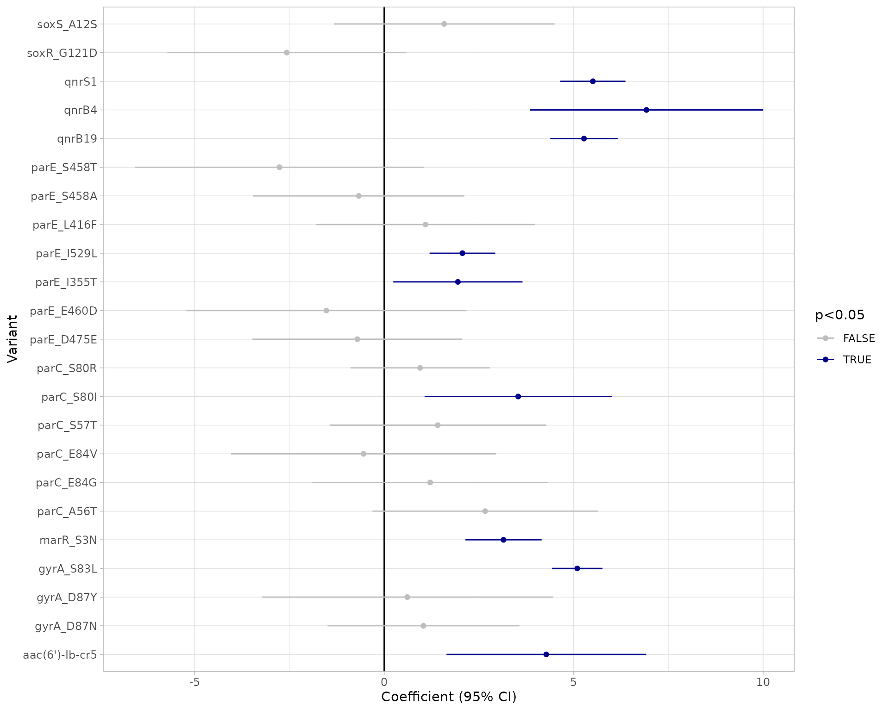

``` r
# Alternatively, use the amr_logistic() function to model R and NWT and plot the results together
models <- amr_logistic(
  geno_table = ecoli_geno,
  pheno_table = ecoli_ast,
  sir_col = "pheno_clsi",
  antibiotic = "Ciprofloxacin",
  drug_class_list = c("Quinolones"),
  maf = 10
)
#>  Defining NWT in binary matrix using ecoff column provided: ecoff 
#> ...Fitting logistic regression model to R using logistf
#>    Filtered data contains 3630 samples (793 => 1, 2837 => 0) and 19 variables.
#> Warning in logistf::logistf(R ~ ., data = to_fit, pl = FALSE): logistf.fit:
#> Maximum number of iterations for full model exceeded. Try to increase the
#> number of iterations or alter step size by passing 'logistf.control(maxit=...,
#> maxstep=...)' to parameter control
#> ...Fitting logistic regression model to NWT using logistf
#>    Filtered data contains 3630 samples (929 => 1, 2701 => 0) and 19 variables.
#> Warning in logistf::logistf(NWT ~ ., data = to_fit, pl = FALSE): logistf.fit:
#> Maximum number of iterations for full model exceeded. Try to increase the
#> number of iterations or alter step size by passing 'logistf.control(maxit=...,
#> maxstep=...)' to parameter control
#> Generating plots
```

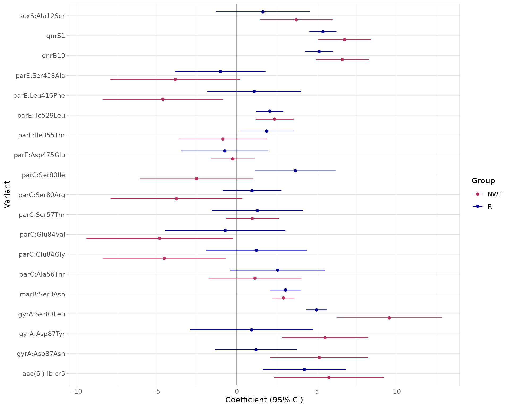

``` r

# Output tables
models$modelR
#> # A tibble: 20 × 5
#>    marker            est ci.lower ci.upper          pval
#>    <chr>           <dbl>    <dbl>    <dbl>         <dbl>
#>  1 (Intercept)    -5.18    -5.66     -4.70 0            
#>  2 gyrA:Ser83Leu   4.98     4.33      5.62 0            
#>  3 gyrA:Asp87Tyr   0.917   -2.94      4.78 0.642        
#>  4 gyrA:Asp87Asn   1.19    -1.38      3.77 0.363        
#>  5 parC:Ser80Ile   3.65     1.13      6.17 0.00457      
#>  6 parE:Ser458Ala -1.03    -3.86      1.79 0.472        
#>  7 parC:Ser80Arg   0.940   -0.896     2.78 0.316        
#>  8 parE:Leu416Phe  1.08    -1.85      4.01 0.471        
#>  9 parC:Ser57Thr   1.28    -1.57      4.13 0.377        
#> 10 soxS:Ala12Ser   1.62    -1.31      4.56 0.279        
#> 11 parC:Ala56Thr   2.54    -0.420     5.50 0.0926       
#> 12 qnrB19          5.13     4.26      6.01 0            
#> 13 aac(6')-Ib-cr5  4.22     1.61      6.83 0.00151      
#> 14 parC:Glu84Val  -0.733   -4.49      3.02 0.702        
#> 15 parE:Ile529Leu  2.04     1.19      2.90 0.00000311   
#> 16 parC:Glu84Gly   1.22    -1.92      4.35 0.448        
#> 17 qnrS1           5.38     4.54      6.22 0            
#> 18 marR:Ser3Asn    3.04     2.06      4.02 0.00000000125
#> 19 parE:Ile355Thr  1.86     0.190     3.53 0.0290       
#> 20 parE:Asp475Glu -0.761   -3.48      1.96 0.583
#> Use ggplot2::autoplot() on this output to visualise

models$modelNWT
#> # A tibble: 20 × 5
#>    marker            est ci.lower ci.upper     pval
#>    <chr>           <dbl>    <dbl>    <dbl>    <dbl>
#>  1 (Intercept)    -3.71    -3.97    -3.46  0       
#>  2 gyrA:Ser83Leu   9.52     6.22    12.8   1.57e- 8
#>  3 gyrA:Asp87Tyr   5.51     2.81     8.21  6.29e- 5
#>  4 gyrA:Asp87Asn   5.14     2.08     8.21  1.00e- 3
#>  5 parC:Ser80Ile  -2.52    -6.06     1.02  1.63e- 1
#>  6 parE:Ser458Ala -3.85    -7.90     0.202 6.26e- 2
#>  7 parC:Ser80Arg  -3.78    -7.89     0.337 7.20e- 2
#>  8 parE:Leu416Phe -4.63    -8.40    -0.858 1.61e- 2
#>  9 parC:Ser57Thr   0.959   -0.709    2.63  2.60e- 1
#> 10 soxS:Ala12Ser   3.71     1.44     5.98  1.38e- 3
#> 11 parC:Ala56Thr   1.13    -1.78     4.03  4.48e- 1
#> 12 qnrB19          6.59     4.92     8.25  8.22e-15
#> 13 aac(6')-Ib-cr5  5.75     2.31     9.19  1.06e- 3
#> 14 parC:Glu84Val  -4.83    -9.41    -0.251 3.87e- 2
#> 15 parE:Ile529Leu  2.35     1.16     3.54  1.07e- 4
#> 16 parC:Glu84Gly  -4.54    -8.41    -0.681 2.11e- 2
#> 17 qnrS1           6.73     5.07     8.39  1.78e-15
#> 18 marR:Ser3Asn    2.91     2.22     3.59  1.11e-16
#> 19 parE:Ile355Thr -0.882   -3.65     1.89  5.32e- 1
#> 20 parE:Asp475Glu -0.263   -1.64     1.12  7.08e- 1
#> Use ggplot2::autoplot() on this output to visualise

# Note the matrix output is the same as cip_bin, but without the MIC data as this is not required
#    for logistic regression.
models$bin_mat
#> # A tibble: 3,630 × 49
#>    id       pheno ecoff     R   NWT gyrA..Ser83Leu gyrA..Asp87Tyr gyrA..Asp87Asn
#>    <chr>    <sir> <sir> <dbl> <dbl>          <dbl>          <dbl>          <dbl>
#>  1 SAMN031…   S     S       0     0              0              0              0
#>  2 SAMN031…   S     S       0     0              0              0              0
#>  3 SAMN031…   S     S       0     0              0              0              0
#>  4 SAMN031…   S     R       0     1              1              0              0
#>  5 SAMN031…   S     R       0     1              0              1              0
#>  6 SAMN031…   S     S       0     0              0              0              0
#>  7 SAMN031…   S     S       0     0              0              0              0
#>  8 SAMN031…   R     R       1     1              1              0              1
#>  9 SAMN031…   S     R       0     1              1              0              0
#> 10 SAMN031…   R     R       1     1              1              0              1
#> # ℹ 3,620 more rows
#> # ℹ 41 more variables: parC..Ser80Ile <dbl>, parE..Ser458Ala <dbl>,
#> #   parC..Ser80Arg <dbl>, parE..Leu416Phe <dbl>, qnrB6 <dbl>,
#> #   gyrA..Asp87Gly <dbl>, parC..Ser57Thr <dbl>, parC..Glu84Ala <dbl>,
#> #   soxS..Ala12Ser <dbl>, qnrB2 <dbl>, qnrS2 <dbl>, parC..Glu84Lys <dbl>,
#> #   parC..Ala56Thr <dbl>, qnrB19 <dbl>, `aac(6')-Ib-cr5` <dbl>,
#> #   parC..Glu84Val <dbl>, parE..Ile529Leu <dbl>, parE..Ser458Thr <dbl>, …
```

### 7. Assess solo positive predictive value of genetic markers

The strongest evidence of the effect of an individual genetic marker on
a drug phenotype is its positive predictive value (PPV) for resistance
amongst strains that carry this marker ‘solo’ with no other markers
known to be associated with resistance to the drug class. This is
referred to as ‘solo PPV’.

The function
[`solo_ppv_analysis()`](https://AMRverse.github.io/AMRgen/reference/solo_ppv_analysis.md)
takes as input our genotype and phenotype tables, and calculates solo
PPV for resistance to a specific drug (included in our phenotype table)
formarkers associated with the specified drug class (included in our
genotype table). It uses the
[`get_binary_matrix()`](https://AMRverse.github.io/AMRgen/reference/get_binary_matrix.md)
function to first calculate the binary matrix, then filters out all
samples that have more than one marker.

It then calculates for each remaining marker, amongst the genomes in
which that marker is found solo, the number of genomes, the number and
proportion that are R or NWT, and the 95% confidence intervals for these
proportions. The values are returned as a table, and also plotted so we
can easily visualise the distribution of S/I/R calls and the solo PPV
for R and NWT, for each solo marker.

The function returns 4 objects:

- `solo_stats`: data frame containing the numbers, proportions and
  confidence intervals for PPV of R and NWT categories

- `amr_binary`: the (wide format) binary matrix for all strains with
  geno/pheno data for the specified drug/class

- `solo_binary`: the (long format) binary matrix for only those strains
  in which a solo marker was found, i.e. the data used to calculate PPV

- `combined_plot`: a plot showing the distribution of S/I/R calls and
  the solo PPV for R and NWT, for each solo marker

``` r
# Run a solo PPV analysis
soloPPV_cipro <- solo_ppv_analysis(
  ecoli_geno,
  ecoli_ast,
  sir_col = "pheno_clsi",
  antibiotic = "Ciprofloxacin",
  drug_class_list = "Quinolones"
)
#>  Defining NWT in binary matrix using ecoff column provided: ecoff
```

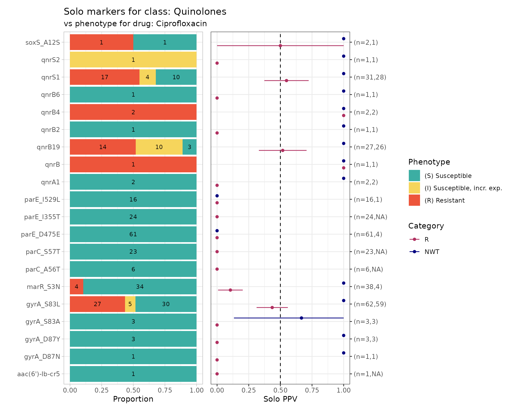

``` r

# Output table
soloPPV_cipro$solo_stats
#> # A tibble: 36 × 8
#>    marker         category     x     n   ppv     se ci.lower ci.upper
#>    <chr>          <chr>    <dbl> <int> <dbl>  <dbl>    <dbl>    <dbl>
#>  1 aac(6')-Ib-cr5 R            0     1 0     0       0          0    
#>  2 gyrA_D87N      R            0     1 0     0       0          0    
#>  3 gyrA_D87Y      R            0     3 0     0       0          0    
#>  4 gyrA_S83A      R            0     3 0     0       0          0    
#>  5 gyrA_S83L      R           27    62 0.435 0.0630  0.312      0.559
#>  6 marR_S3N       R            4    38 0.105 0.0498  0.00769    0.203
#>  7 parC_A56T      R            0     6 0     0       0          0    
#>  8 parC_S57T      R            0    23 0     0       0          0    
#>  9 parE_D475E     R            0    61 0     0       0          0    
#> 10 parE_I355T     R            0    24 0     0       0          0    
#> # ℹ 26 more rows

# Interim matrices with data used to compute stats and plots
soloPPV_cipro$solo_binary
#> # A tibble: 306 × 9
#>    id           pheno ecoff   mic  disk     R   NWT marker    value
#>    <chr>        <sir> <sir> <mic> <dsk> <dbl> <dbl> <chr>     <dbl>
#>  1 SAMN03177618   S     R    0.25    NA     0     1 gyrA_S83L     1
#>  2 SAMN03177619   S     R    0.12    NA     0     1 gyrA_D87Y     1
#>  3 SAMN03177623   S     R    0.25    NA     0     1 gyrA_S83L     1
#>  4 SAMN03177631   S     R    0.25    NA     0     1 gyrA_S83L     1
#>  5 SAMN03177635   S     R    0.25    NA     0     1 gyrA_S83L     1
#>  6 SAMN03177637   S     R    0.25    NA     0     1 gyrA_S83L     1
#>  7 SAMN03177638   S     R    0.25    NA     0     1 qnrB6         1
#>  8 SAMN03177639   S     R    0.12    NA     0     1 gyrA_S83L     1
#>  9 SAMN03177643   S     R    0.25    NA     0     1 gyrA_S83L     1
#> 10 SAMN03177646   S     R    0.25    NA     0     1 gyrA_S83L     1
#> # ℹ 296 more rows

soloPPV_cipro$amr_binary
#> # A tibble: 3,630 × 51
#>    id        pheno ecoff     mic  disk     R   NWT gyrA_S83L gyrA_D87Y gyrA_D87N
#>    <chr>     <sir> <sir>   <mic> <dsk> <dbl> <dbl>     <dbl>     <dbl>     <dbl>
#>  1 SAMN0317…   S     S   <=0.015    NA     0     0         0         0         0
#>  2 SAMN0317…   S     S   <=0.015    NA     0     0         0         0         0
#>  3 SAMN0317…   S     S   <=0.015    NA     0     0         0         0         0
#>  4 SAMN0317…   S     R     0.250    NA     0     1         1         0         0
#>  5 SAMN0317…   S     R     0.120    NA     0     1         0         1         0
#>  6 SAMN0317…   S     S   <=0.015    NA     0     0         0         0         0
#>  7 SAMN0317…   S     S   <=0.015    NA     0     0         0         0         0
#>  8 SAMN0317…   R     R    >4.000    NA     1     1         1         0         1
#>  9 SAMN0317…   S     R     0.250    NA     0     1         1         0         0
#> 10 SAMN0317…   R     R    >4.000    NA     1     1         1         0         1
#> # ℹ 3,620 more rows
#> # ℹ 41 more variables: parC_S80I <dbl>, parE_S458A <dbl>, parC_S80R <dbl>,
#> #   parE_L416F <dbl>, qnrB6 <dbl>, gyrA_D87G <dbl>, parC_S57T <dbl>,
#> #   parC_E84A <dbl>, soxS_A12S <dbl>, qnrB2 <dbl>, qnrS2 <dbl>,
#> #   parC_E84K <dbl>, parC_A56T <dbl>, qnrB19 <dbl>, `aac(6')-Ib-cr5` <dbl>,
#> #   parC_E84V <dbl>, parE_I529L <dbl>, parE_S458T <dbl>, parE_E460D <dbl>,
#> #   parC_E84G <dbl>, qnrS1 <dbl>, marR_S3N <dbl>, `aac(6')-Ib-cr` <dbl>, …
```

### 8. Compare markers with assay data

So far we have considered only the impact of individual markers, and
their association with categorical S/I/R or WT/NWT calls.

The function
[`amr_upset()`](https://AMRverse.github.io/AMRgen/reference/amr_upset.md)
takes as binary matrix table `cip_bin` summarising ciprofloxacin
resistance vs quinolone markers, generated using
[`get_binary_matrix()`](https://AMRverse.github.io/AMRgen/reference/get_binary_matrix.md),
and explores the distribution of MIC or disk diffusion assay values for
all observed combinations of markers (solo or multiple markers). It
visualises the data in the form of an upset plot, showing the
distribution of assay values and S/I/R calls for each observed marker
combination, and returns a summary of these distributions (including
sample size, median and interquartile range, number and proportion
classified as R).

The function returns 2 objects:

- `summary`: data frame containing summarising the data associated with
  each combination of markers

- `plot`: an upset plot showing the distribution of assay values, and
  breakdown of S/I/R calls, for each observed marker combination

``` r
# Compare ciprofloxacin MIC data with quinolone marker combinations,
#    using the binary matrix we constructed earlier via get_binary_matrix()
cipro_mic_upset <- amr_upset(
  cip_bin,
  min_set_size = 2,
  assay = "mic",
  order = "value"
)
```

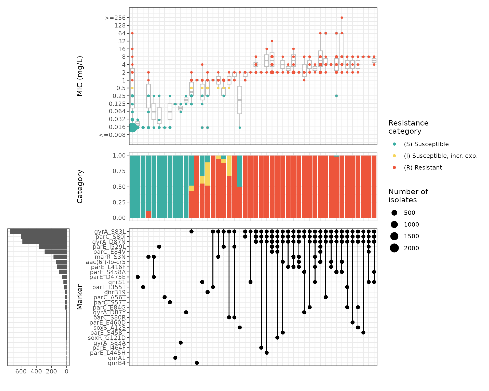

``` r

# Output table
cipro_mic_upset$summary
#> # A tibble: 103 × 19
#>    marker_list        marker_count     n combination_id   R.n   R.ppv R.ci_lower
#>    <chr>                     <dbl> <int> <chr>          <dbl>   <dbl>      <dbl>
#>  1 ""                            0  2590 0_0_0_0_0_0_0…    10 0.00386    0.00147
#>  2 "qnrB"                        1     1 0_0_0_0_0_0_0…     1 1          1      
#>  3 "parE_E460K, gyrA…            2     1 0_0_0_0_0_0_0…     1 1          1      
#>  4 "parE_D475E"                  1    61 0_0_0_0_0_0_0…     0 0          0      
#>  5 "qnrA1"                       1     2 0_0_0_0_0_0_0…     0 0          0      
#>  6 "gyrA_S83A"                   1     3 0_0_0_0_0_0_0…     0 0          0      
#>  7 "qnrB4"                       1     2 0_0_0_0_0_0_0…     2 1          1      
#>  8 "parE_I355T"                  1    24 0_0_0_0_0_0_0…     0 0          0      
#>  9 "marR_S3N"                    1    38 0_0_0_0_0_0_0…     4 0.105      0.00769
#> 10 "marR_S3N, parE_D…            2     4 0_0_0_0_0_0_0…     0 0          0      
#> # ℹ 93 more rows
#> # ℹ 12 more variables: R.ci_upper <dbl>, NWT.n <dbl>, NWT.ppv <dbl>,
#> #   NWT.ci_lower <dbl>, NWT.ci_upper <dbl>, median_excludeRangeValues <dbl>,
#> #   q25_excludeRangeValues <dbl>, q75_excludeRangeValues <dbl>,
#> #   n_excludeRangeValues <int>, median_ignoreRanges <dbl>,
#> #   q25_ignoreRanges <dbl>, q75_ignoreRanges <dbl>
```
